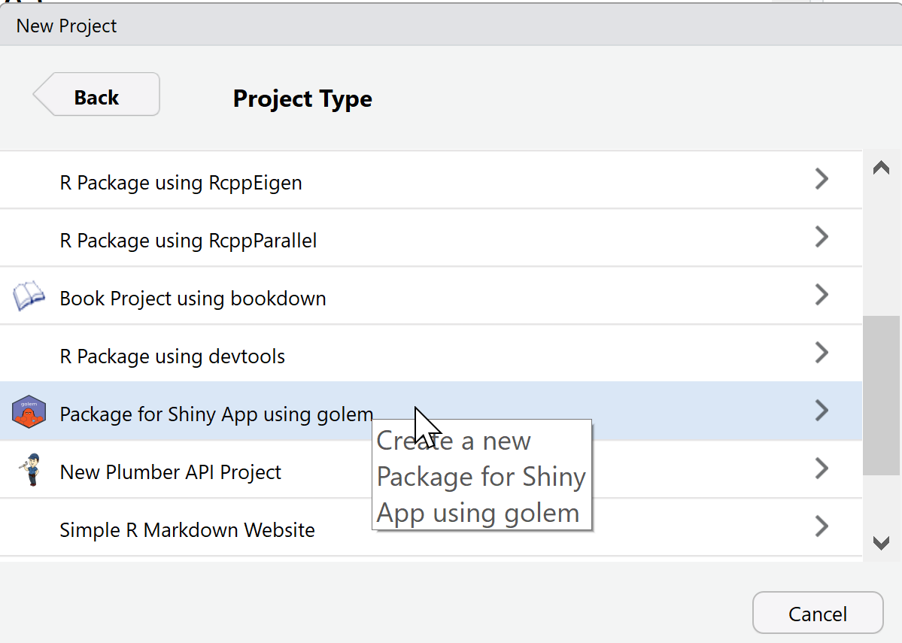

# 01. Getting started

## Installing {golem}

You can install the stable version of
[golem](https://thinkr-open.github.io/golem/) from CRAN:

``` r
install.packages("golem")
```

The development version of [golem](https://thinkr-open.github.io/golem/)
can be installed from GitHub using the
[remotes](https://remotes.r-lib.org) package:

``` r
remotes::install_github("Thinkr-open/golem")
```

## Getting started

Note before using [golem](https://thinkr-open.github.io/golem/):

- A [golem](https://thinkr-open.github.io/golem/) app is contained
  inside a package, so knowing how to build a package is highly
  recommended. On the plus side, everything you know about package
  development can be reused in
  [golem](https://thinkr-open.github.io/golem/).

- A [golem](https://thinkr-open.github.io/golem/) app works better if
  you are working with `shiny modules`, so knowing how modules work is
  recommended, but not mandatory.

In the rest of the Vignettes, we’ll assume you’re working in RStudio.

### Create a package

Once the package is installed, you can got to *File \> New Project…* in
RStudio, and choose *“Package for Shiny App Using golem”* input:



If you want to do it directly via the command line, use:

``` r
golem::create_golem(path = "path/to/package")
```

This command allows you to create “illegally-named” package (for
example, `1234`) by passing the `check_name` argument to `FALSE`. Note
that this is not recommended and **should only be done if you know what
you are doing**.

Once you’ve got that, a new RStudio project will be launched. Here is
the structure of this project:

    #> ├── DESCRIPTION 
    #> ├── NAMESPACE 
    #> ├── R 
    #> │   ├── app_config.R 
    #> │   ├── app_server.R 
    #> │   ├── app_ui.R 
    #> │   └── run_app.R 
    #> ├── dev 
    #> │   ├── 01_start.R 
    #> │   ├── 02_dev.R 
    #> │   ├── 03_deploy.R 
    #> │   └── run_dev.R 
    #> ├── inst 
    #> │   ├── app 
    #> │   │   └── www 
    #> │   │       └── favicon.ico 
    #> │   └── golem-config.yml 
    #> └── man 
    #>     └── run_app.Rd

If you’re already familiar with R packages, most of these files will
seem very familiar to you. That’s because a
[golem](https://thinkr-open.github.io/golem/) app IS a package.

- `DESCRIPTION` & `NAMESPACE`: Package meta-data.

- `R/app_config.R`: Used to read inside
  [golem](https://thinkr-open.github.io/golem/) config file located at
  `inst/golem-config.yml`.

- `R/app_server.R`, `R/app_ui.R`: Top level UI and server elements.

- `R/run_app.R`: a function to configure and launch the application.

- `dev/`: Scripts that will be used along the process of developing your
  app. You don’t need to fill all the script before starting: use them
  as a notebook for keeping track of what you’re doing all along the
  project life.

- `inst/app/www`: Where you will add external dependencies in `www`
  (images, css, etc), notably added with the `golem` functions used to
  create external resources.

- `man`: Package documentation, to be generated by R &
  [roxygen2](https://roxygen2.r-lib.org/).

## `dev/01_start.R`

Once you’ve created your project, the first file that opens is
`dev/01_start.R`. This file contains a series of commands that you’ll
have to run once, at the beginning of the project.

Note that you don’t have to fill everything, even though it’s strongly
recommended.

### Fill the DESCRIPTION

First, fill the `DESCRIPTION` by adding information about the package
that will contain your app. The first function,
[`fill_desc()`](https://thinkr-open.github.io/golem/reference/fill_desc.md),
can be used to fill your `DESCRIPTION` file:

``` r
golem::fill_desc(
  pkg_name = "shinyexample", # The name of the golem package containing the app (typically lowercase, no underscore or periods)
  pkg_title = "PKG_TITLE", # What the Package Does (One Line, Title Case, No Period)
  pkg_description = "PKG_DESC.", # What the package does (one paragraph).
  authors = person(
    given = "AUTHOR_FIRST", # Your First Name
    family = "AUTHOR_LAST", # Your Last Name
    email = "AUTHOR@MAIL.COM", # Your email
    role = c("aut", "cre"), # Your role (here author/creator)
    set_options = TRUE # Set the global golem options
  ),
  repo_url = NULL, # The URL of the GitHub repo (optional),
  pkg_version = "0.0.0.9000" # The version of the package containing the app
)
```

About [the DESCRIPTION file](https://r-pkgs.org/description.html).

Additionally,
[`fill_desc()`](https://thinkr-open.github.io/golem/reference/fill_desc.md)
sets a series of recommended global options in `golem-config.yml` that
will be reused inside [golem](https://thinkr-open.github.io/golem/).

### Set common Files

If you want to use the MIT license, README, code of conduct, lifecycle
badge, a news file, etc.

``` r
## See ?usethis for more information
usethis::use_mit_license("Golem User") # You can set another license here
usethis::use_readme_rmd(open = FALSE)
usethis::use_code_of_conduct()
usethis::use_lifecycle_badge("Experimental")
usethis::use_news_md(open = FALSE)
```

See [`{usethis}`](https://usethis.r-lib.org/) for more info about these
functions.

### Init Tests

Create a template for tests:

``` r
golem::use_recommended_tests()
```

About [tests in a package](https://r-pkgs.org/testing-basics.html).

### Use Recommended Packages

This will add [shiny](https://shiny.posit.co/),
[DT](https://github.com/rstudio/DT),
[attempt](https://github.com/ColinFay/attempt),
[glue](https://glue.tidyverse.org/),
[htmltools](https://github.com/rstudio/htmltools), and
[golem](https://thinkr-open.github.io/golem/) as dependencies to your
package:

``` r
golem::use_recommended_deps()
```

### Add various tools

- If you want to change the default favicon:

  ``` r
  # Remove current favicon
  golem::remove_favicon()
  # Add a new one
  golem::use_favicon(path = "path/to/favicon")
  ```

  Note that you can add an URL, and the favicon will be downloaded to
  the `inst/app/www` folder.

> **Note**: If you are deploying your app with
> [ShinyProxy](https://www.shinyproxy.io/), your favicon should have the
> `.png` extension, otherwise it is not going to work.

- Utils: these two functions add two files with additional helper
  functions for your [golem](https://thinkr-open.github.io/golem/)
  project. They can be used along the process of building your app:

  ``` r
  golem::use_utils_ui(with_test = TRUE)
  golem::use_utils_server(with_test = TRUE)
  ```

  For a detailed description of the generated functions see the
  respective files `R/golem_utils_server.R` and `R/golem_utils_ui.R` for
  which also default tests are added in `tests/testthat` (to suppress
  this set `with_test = FALSE` in the above calls).

## Try the app

To launch the app run:

``` r
golem::run_dev()
```

You’re now set! You’ve successfully initiated the project and can go to
`dev/02_dev.R`:

``` r
rstudioapi::navigateToFile("dev/02_dev.R")
```
